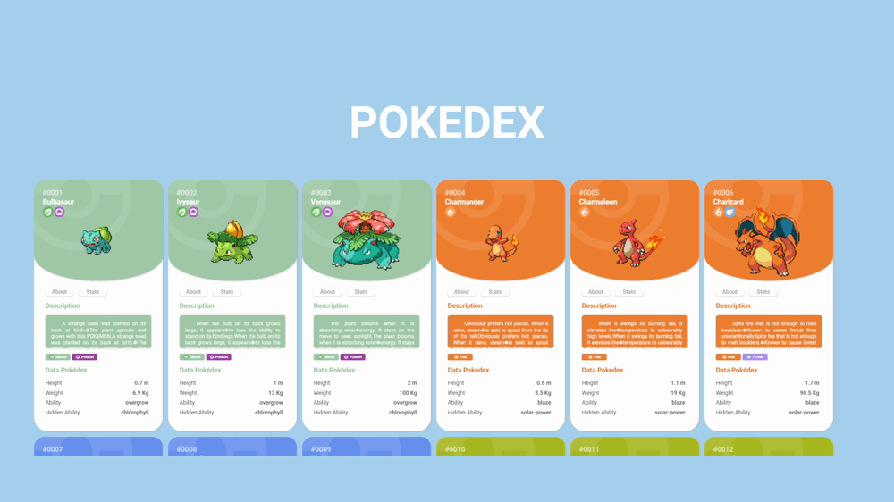

## :pencil2: Pokédex

  

## :file_folder: Sobre o projeto

  Esse projeto se trata de uma aplicação web que se conecta com a conhecida PokeAPI através de chamadas assíncronas do JavaScript para mostrar os Pokémons com os seus respectivos cards com suas informações de status base, sprite, fraquezas, resistencias, numero e descrição da pokédex, além da implementação de métodos de paginação com auxilio do react e seu controle de estados. 

## :desktop_computer: Tecnologias
As tecnologias utilizadas foram
- <a href="https://developer.mozilla.org/en-US/docs/Web/HTML">HTML</a>
- <a href="https://developer.mozilla.org/en-US/docs/Web/CSS">CSS</a>
- <a href="https://developer.mozilla.org/en-US/docs/Web/JavaScript">JavaScript</a>
- <a href="https://axios-http.com/docs/intro">Axios</a>
- <a href="https://react.dev">React</a>

## Licença
Projetos feitos por <a href="https://www.linkedin.com/in/joao-pedro-silva-lopes/">João Pedro</a>
